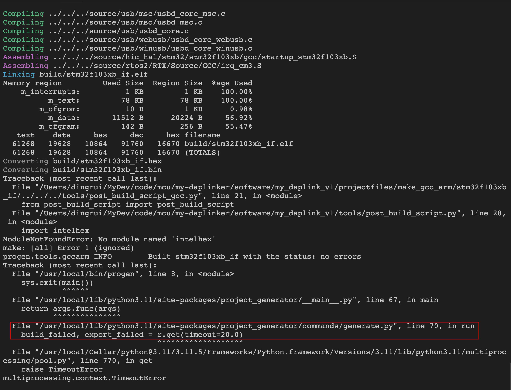

手动编译DAPLink源码及烧录
---

### 1 基础设施

| Name              | Ver    |
| ----------------- | ------ |
| Python            | 3.11.4 |
| pip               | 23.0.1 |
| make              | 3.81   |
| arm-none-eabi-gcc | 10.3.1 |

==官网特地提示`arm-none-eabi`交叉编译器使用10.3版本的，其他更新版本可能会报错。==

### 2 python的虚拟环境

在linux中使用3.11的py，已经不推荐使用`pip install 包`的方式安装软件包了，这就导致了安装`virtualenv`包丧失了跨平台性，改用`python -m venv 虚拟包名`的方式创建虚拟环境。

```shell
cd DAPLink
python -m venv venv
source venv/bin/activate
pip install -r requirements.txt
```

### 3 编译DAPLink源码

```shell
progen generate -t make_gcc_arm -p stm32f103xb_bl -b

progen generate -t make_gcc_arm -p stm32f103xb_if -b

deactivate
```

### 4 关于py包超时



到指定的源码更改一下timeout即可。

### 5 编译结果

在projectfiles目录下

```txt
.
└── make_gcc_arm
    ├── stm32f103xb_bl
    │   ├── Makefile
    │   └── build
    └── stm32f103xb_if
        ├── Makefile
        └── build
```